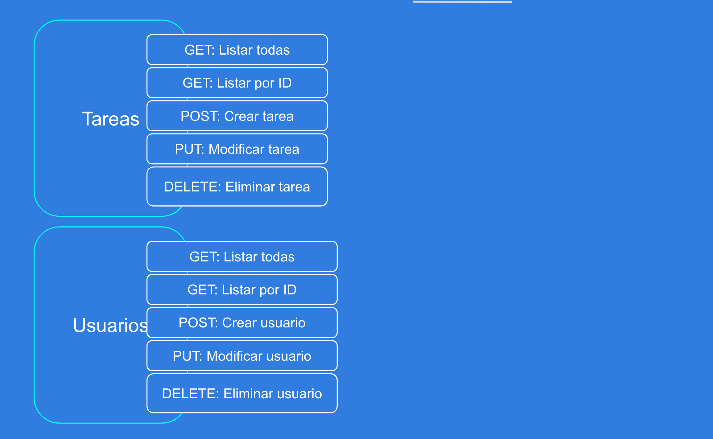

## API-TASK

API que permite gestionar tareas utilizando mongoose, expressjs y MongoDbx.

## RUTAS A CREAR

TASK:  http://localhost:5000/api/task

- GET: 
    `/task`
    `/task/id`

- POST:
    `/task`

- PUT:
    `/task/id`

- DELETE:
    `/task/id`

USER:  http://localhost:5000/api/user

- GET: 
    `/user`
    `/user/id`

- POST:
    `/user`

- PUT:
    `/user/id`

- DELETE:
    `/user/id`

## INSTALACION MONGOdb

- Puedes utilizar la receta (docker-compose) para utilizar mongoDb en tu equipo ingresando a [recetas-docker](https://github.com/mortegac/recetas-docker/tree/master/Docker-Compose/MongoDb)

- Si no tienes instalado docker, mira este articulo: 
(Instalando Docker)[https://medium.com/javascript-nicaragua/instalando-docker-d736fe0822a8]

- Quieres profundizar un poco más usando docker para aplicaciones nodejs y Mongodb visita 
(Dockerizando NodeJS y MongoDB)[https://medium.com/devschile/dockerizando-nodejs-y-mongodb-ad24fedab8f2]